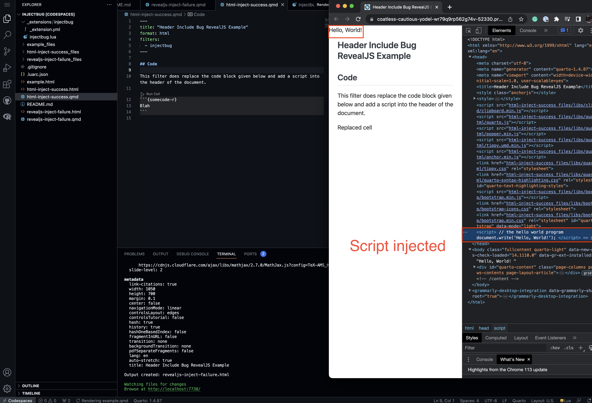
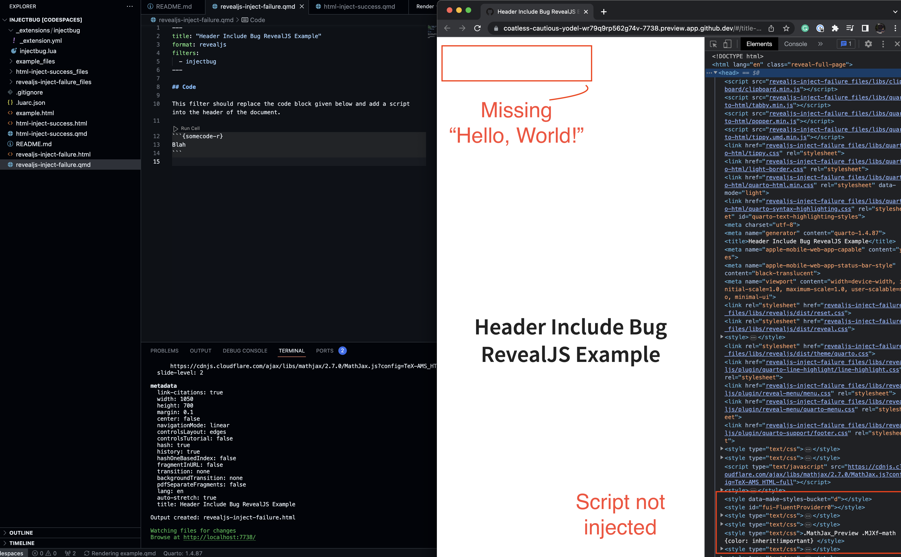

# Injectbug Extension For Quarto

Demo of a bug injecting text into the header area of revealjs.

## Installing

You can test it out via: 

```sh
quarto add coatless/quarto-ext-revealjs-bug
```

This will install the extension under the `_extensions` subdirectory.
If you're using version control, you will want to check in this directory.

## Demo

The following works 
````markdown
---
title: "Header Include Works with HTML Example"
format: html
filters:
  - injectbug
---

## Code

This filter does replace the code block given below and add a script into the header of the document.

```{somecode-r}
Blah
```

````



Switching to the format `revealjs` does not yield the same injection:

````markdown
---
title: "Header Include Bug RevealJS Example"
format: revealjs
filters:
  - injectbug
---

## Code

This filter should replace the code block given below and add a script into the header of the document; but, it doesn't.

```{somecode-r}
Blah
```

````





## Developer Notes

The repository is setup to use a devcontainer within a GitHub Codespace.

We created the quarto extension by using: 

```sh
quarto create extension filter
```

Then, we placed inside the `injectbug.lua` the following:


```lua
local injectionComplete = false

function injectIntoHeader()
  
  -- If we've included the initialization, then bail.
  if injectionComplete then
    return
  end
  
  -- Otherwise, let's include the initialization script _once_
  injectionComplete = true

  -- Sample initialization
  local example_text = [[
    <script>
    // the hello world program
    document.write('Hello, World!');
    </script>
  ]]

  -- Insert the web initialization
  -- https://quarto.org/docs/extensions/lua-api.html#includes
  quarto.doc.include_text("in-header", example_text)
end

function detectCodeCell(el)
      
  -- Let's see what's going on here:
  -- quarto.log.output(el)
  
  -- Should display the following elements:
  -- https://pandoc.org/lua-filters.html#type-codeblock
  
  -- Verify the element has attributes and the document type is HTML
  if el.attr and quarto.doc.is_format("html") then

    if el.attr.classes:includes("{somecode-r}") then
      
      -- Make sure we've initialized the code block
      injectIntoHeader()

      -- Return the modified HTML template as a raw cell
      return pandoc.RawInline('html', 'Replaced cell')
    end
  end
  -- Allow for a pass through in other languages
  return el
end

return {
  {
    CodeBlock = detectCodeCell
  }
}
```

